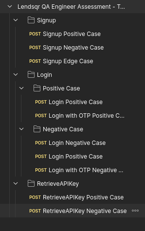
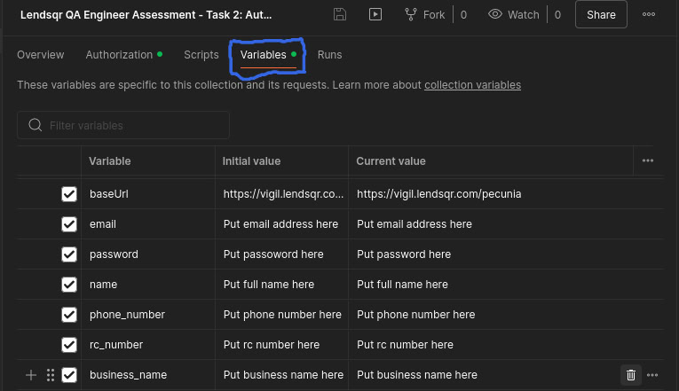
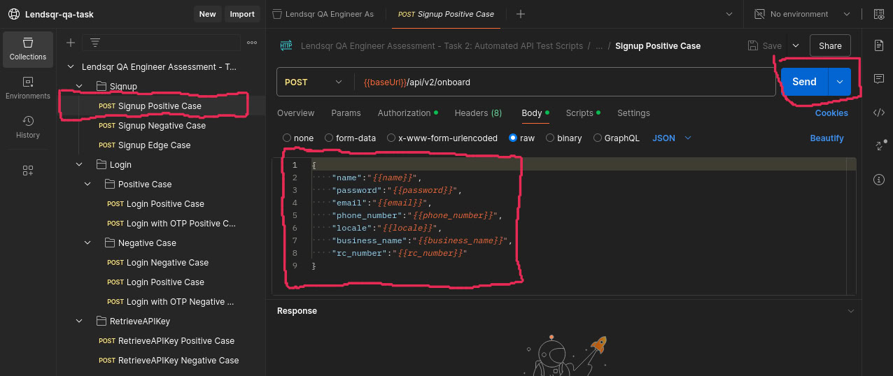

# lendsqr-qa-assessment-task
This repository contains automated test scripts developed for Task 2 of the Lendsqr QA Engineer Assessment. These scripts utilize Postman to automate the execution of API test cases documented in Task 1. The scripts cover functionalities related to Signup, Login, and Retrieving API Keys, excluding the Oraculi Mobile SDK (Beta) module.

## Setup Instructions (for Postman Desktop)

### Step 1:

**Install Postman**: Download and install the latest version of Postman from https://www.postman.com/downloads/.

### Step 2:

**Clone this Repository**: Clone this repository to your local machine using Git.

### Step 3:

**Import Postman Collection**: Import the Postman collection file ```Lendsqr QA Engineer Assessment - Task 2- Automated API Test Scripts.postman_collection.json``` located in this repository into your Postman application.

## Setup Instructions (for Postman Web)
**Access the Postman repo link**: Click [here](https://www.postman.com/c0d33ngr/workspace/lendsqr-qa-task/collection/36489031-cce21292-3bfe-42fd-8721-20f421ec61df?action=share&creator=36489031) to access the repo link from Postman web. Then you can continue with configuring collection variables.

Note: You'll need to have a Postman account with them to continue.

## Configure Collection Variables

The Postman collection utilizes collection variables to store certain values. These variables need to be replaced with your actual API environment details before running the tests.

* After you have imported the collection file ```Lendsqr QA Engineer Assessment - Task 2- Automated API Test Scripts.postman_collection.json```.



* Navigate to the **"Variables"** tab.
* Locate the defined collection variables
    * `apiKey` This is the app API key
    * `name` This is the full name of the account
    * `token` This is the OTP sent to real phone number or email address
    * `AuthToken` This is authorization header value gotten from web browser tool
    * `phone_number` This is real phone number
    * `rc_number` This is the Registered Company number assigned to companies by Corporate Affair Commission (CAC)
    * `business_name` This is the business name
    * `appID` This is the app ID which it's API key is to be retrieved

* Update the value field for each variable with actual values.
  * For example, fill `apiKey` with the actual Lendsqr Adjutor App API Key.

## Running the Tests

Once you've imported your collection and configured collection variables, you can navigate to the collection in Postman. The collection contains individual test scripts for various functionalities.

* You can execute each test script individually by selecting the desired script within the collection and clicking the "Send" button.

* Alternatively, Postman offers Runner features (desktop app) or Runner collections (web app) to run multiple tests in sequence. However, for cases requiring manual input or OTP verification, individual execution is recommended.

**Important Note: OTP**

Please be aware that some test scripts might require user intervention during execution. This is because certain functionalities, like login with OTP requiring specific data input, might not be fully automatable within the scripts themselves.

* When encountering a test script requiring an OTP, you'll need to provide the actual OTP received through email or SMS during test execution.

**Running these tests individually allows you to provide the necessary input during execution.**


## Additional Notes

* This repository serves as a demonstration of automated API test scripts for the Lendsqr QA Engineer Assessment.
* Feel free to explore and adapt these scripts for further testing purposes.

## License

MIT License


